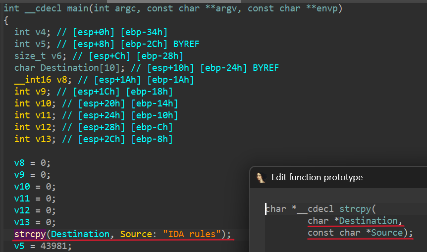

# HappyIDA
Make your IDA Happy will also make you Happy!

HappyIDA is an IDAPython plugin that adds a set of convenience hooks and UI helpers to the Hex‑Rays decompiler.
It offers multiple functionalities:

- Function parameter labeling – Swift‑style labels, rename / type edits at the call site.
- Clipboard helpers – copy / paste names, types, and assign types directly from the clipboard.
- Function navigation – double‑click on a vtable name to jump or search for the matching function.
- Try catch block support (SEH) – visual highlights and try...catch clause rebuild support.
- Rust string handling – automatically pretty‑prints Rust strings in decompiled pseudocode.

## Installation

1. IDA Pro 9.0 or later (Hex‑Rays must be enabled).
2. Directly clone this repo to your IDAPython plugins directory (usually ~/.idapro/plugins/)
3. Restart IDA

## Plugin Structure

```
HappyIDA/
├─ ida-plugin.json                # IDA metadata (plugin name, author)
├─ main.py                        # Loader stub for IDA
├─ demo.cpp                       # Example C++ file for demo
├─ images/                        # README screenshots and GIFs
└─ ida_happy/                     # Core package
    ├─ __init__.py                # Plugin class and action registration
    ├─ miscutils.py               # Helpers (logging, type parsing, tags)
    ├─ undoutils.py               # Undo wrappers and status enum
    └─ modules/                   # Individual feature modules
        ├─ argument_labeler/
        │   ├─ __init__.py
        │   ├─ label.py
        │   ├─ edit.py
        │   ├─ sync_name.py
        │   └─ sync_type.py
        ├─ func_navigate.py
        ├─ rust_string.py
        └─ seh/
            ├─ __init__.py
            ├─ highlight.py
            └─ rebuild.py
```

### Modules

| Module | Functionality |
|--------|----------------|
| argument_labeler | Adds Swift‑style parameter labels, rename and retype directly at call sites. |
| func_navigate | Double‑click vtable name → jump or search for matching function. |
| rust_string | Detects Rust binaries and pretty‑prints string literals in pseudocode. |
| seh | Highlights structured exception handling blocks and rebuilds SEH try catch clause. |

## Features & Usage

| Feature | How to use |
|---------|------------|
| Copy / Paste Name | C / V for copy and paste name. |
| Copy / Paste Type | Ctrl-Alt-C / Ctrl-Alt-V for copy and paste type. |
| Edit Local Type | Press E on a highlighted variable to open IDA's type editor for that local. |
| Edit/Sync Parameter | Press N (rename) or Y (set type) on an argument in a call; double-click labels/args to sync names, or a cast to sync types. |
| Navigate Functions | Double‑click on a vtable entry or member pointer in pseudocode. |
| Rust String Pretty Print | Rust strings will be correctly printed in Hex‑Rays. |
| SEH Highlight | SEH blocks are visually highlighted. |
| Rebuild SEH | Rebuild SEH to reconstruct try/except blocks. |

### Parameter labeling

Swift‑style labels are injected directly into call sites so argument intent is clear without jumping to the prototype.

No more memorizing parameters or bouncing back and forth.

Labels stay out of the way when the argument name and type already match the parameter.



### Edit Parameter

Use `N` to argument rename or `Y` to set argument type while the cursor is on a label. HappyIDA routes those actions to the function parameter instead of the call-site variable.

### Sync Parameter

Double-click a label to sync the parameter name to the argument, or double-click an argument name to sync it back into an parameter. The label hides itself once the argument already matches the parameter name and type.


Bonus: double-click a type cast to sync the parameter type to the argument when they differ. Type sync follows the same flow as name sync.


### Copy / Paste Name

Press `C` to grab the highlighted identifier to the system clipboard, then press `V` to rename the current variable or function to that value.

It shines when a debug string exposes a function/variable name you want to reuse, or when diffing two IDA instances side by side. Copy in one window and paste-rename in the other.


### Copy / Paste Type 

Works like Copy / Paste Name, but for types. Press `Ctrl+Alt+C` to copy the type of the highlighted function, variable, or member and store it as text in your system clipboard. Press `Ctrl+Alt+V` to apply that type to the item under your cursor. Since it re-parses the string from the clipboard, you can also copy any text that can be parsed as a type from Hex-Rays output and paste it back.


### Edit Local Type

Press `E` on a highlighted variable to open IDA's type editor for that local. Useful when you want to refine a type beyond quick paste or cast adjustments.


### SEH Highlight and Rebuild

IDA already understands C++ try/catch, but SEH often decompiles without the missing `__except` block.

- Highlight: SEH `__try` regions are colored in pseudocode. Highlight authored by [angelboy](https://github.com/scwuaptx).
- Rebuild (experimental): Injects the missing `__except(...)` to make the SEH flow visible again. Use with caution.

Example output after rebuild:
```
int __cdecl sub_401160(int a1)
{
  __try {
    if ( !a1 )
      RaiseException(dwExceptionCode: 0xE0FFEE00, dwExceptionFlags: 0, nNumberOfArguments: 0, lpArguments: 0);
  }
  __except(...) { return -1; }
  return 1;
}
```


You can toggle SEH highlighting from the pseudocode context menu (right-click).


Highlight color is set in `ida_happy/modules/seh/highlight.py` via `bgcolor`, tweak it if you want a different tint.

### Navigate Functions 

Double-click a vtable entry or member pointer in pseudocode to jump to the target function. If there is no exact match, HappyIDA shows a partial-match candidate list. This helps with C++ polymorphism when overrides share a base member name but add prefixes or suffixes.


## License

Licensed under the GPL license. See LICENSE for details.
